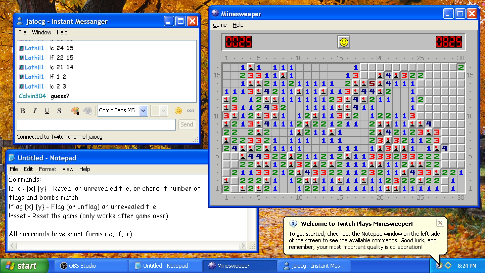

# Twitch Plays

A colletion of various "Twitch Plays" styled games, all packed neatly into one [NodeCG](https://nodecg.dev) bundle. Most games are built entirely as graphics, and built to be modular. All files for games are stored inside of `/graphics`, and are separated per-game.

Obvious inspirations and shoutouts to [TwitchPlaysPokemon](https://www.twitch.tv/twitchplayspokemon). Without them, this whole "Twitch Plays" fad wouldn't exist.

Actual graphics and image files aren't included, however screenshots are provided for you to make your own. :)

## Games

### Minesweeper

A "clone" of the Windows XP implementation of Minesweeper, following a relatively basic tutorial from [Web Dev Simplified](https://www.youtube.com/watch?v=kBMnD_aElCQ), and custom connevtivity to Twitch chat.

#### Commands:
- `!click {x} {y}` - Reveals an unrevealed tile, or chords if the number of surrounding flags and bombs match
- `!flag {x} {y}` - Flags (or unflags) an unrevealed tile
- `!reset` - Resets the game (only works after game over)

All commands have short-form versions, such as `!c` for `!click`.